# Configuration

What was configured in this GLPI instance and why it matters operationally. Written in plain
first person, and **only** for items actually configured by hand. Anything skipped is marked
as skipped, not described as done.

Each section follows the same shape:

> **What.** what was configured
> **How.** the steps taken in GLPI
> **Why it matters.** the operational purpose
> **Screenshot.** proof in `docs/screenshots/`
> **Status.** done or skipped

<!-- TEMPLATE, copy per item:
### <Item name>
- **What.**
- **How.**
- **Why it matters.**
- **Screenshot.** 
- **Status.** done
-->

---

## Security hardening
- **What.** Rotated the passwords on all four default GLPI accounts that ship with well-known credentials. `glpi` (super-admin), `tech`, `normal`, and `post-only`.
- **How.** Under **Administration → Users**, opened each of the four accounts and set a new strong, unique password. The built-in `glpi-system` account was intentionally left untouched. It's a non-interactive system account with no default login password, and altering it can interfere with GLPI's internal and inventory functions.
- **Why it matters.** GLPI ships with publicly documented default credentials. Rotating them immediately closes a standard initial-access risk before any other configuration. On a fresh install, GLPI shows a security banner naming the at-risk accounts; clearing them removes the warning.
- **Screenshots.**
  - Default credentials created at install. 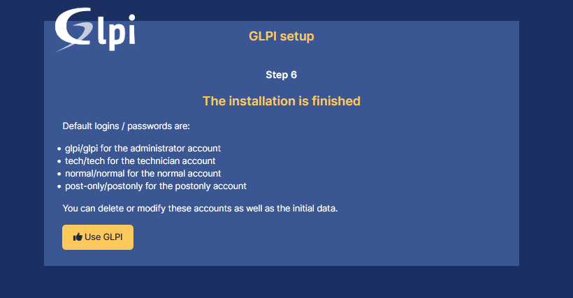
  - Security warning **before** hardening, the banner naming the at-risk default accounts. 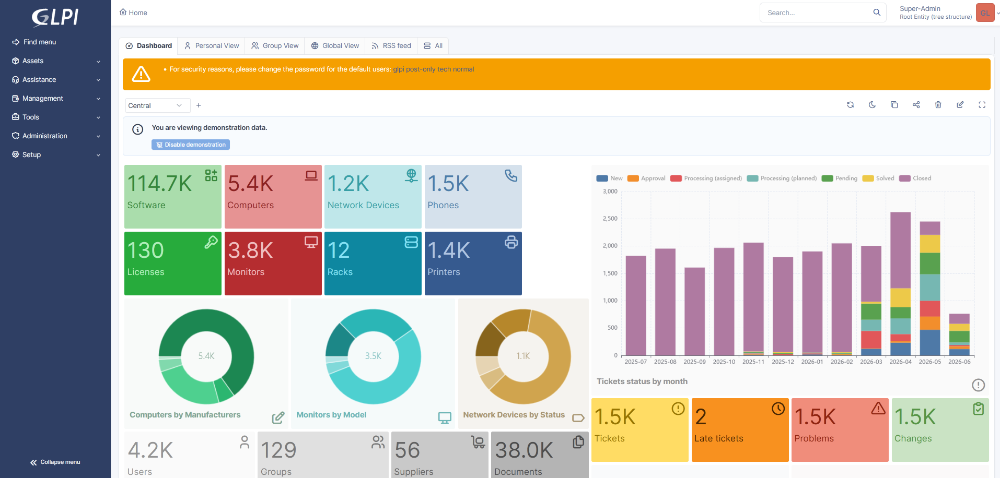
  - The accounts, managed under Administration → Users. 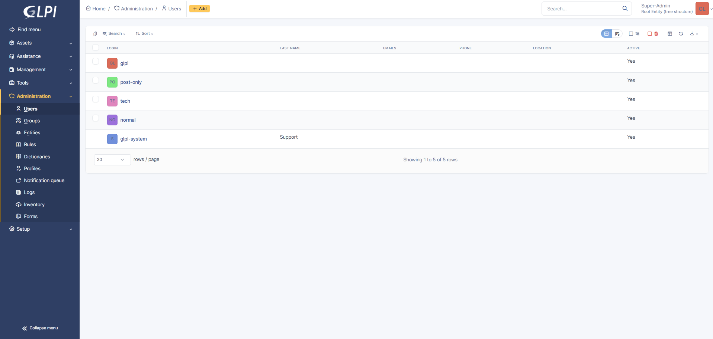
  - **After** hardening, warning cleared. 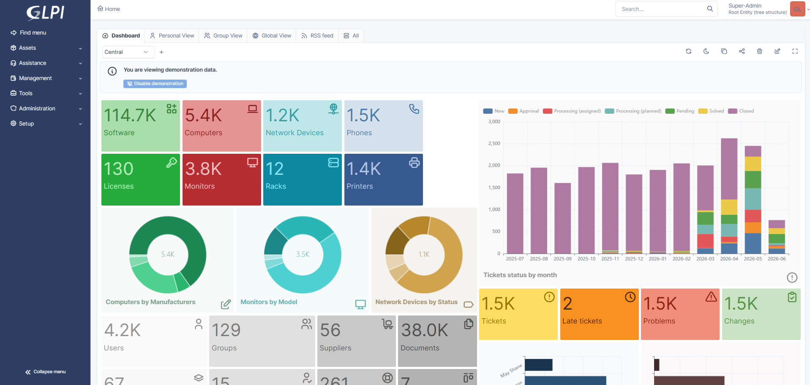
- **Status.** done

## Incident categorization
- **What.** A small ITIL-style category tree with four top-level categories. Hardware, Software, Network, Access.
- **How.** Under **Setup → Dropdowns → ITIL categories** (in the Assistance group), added each of the four categories via **+ Add**.
- **Why it matters.** Consistent categories make tickets routable and reportable instead of free-text chaos, and they're the key an assignment rule uses to send a ticket to the right team.
- **Screenshot.** 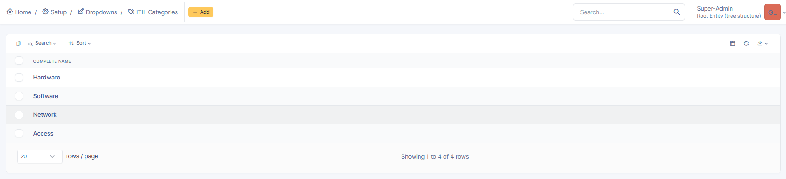
- **Status.** done

## Incident management and service request fulfillment
- **What.** Logged a couple of incidents and a couple of service requests.
- **How.** _TODO (Phase 3)_
- **Why it matters.** Demonstrates the two core ticket workflows, unplanned disruptions and standard requests, handled distinctly.
- **Screenshot.** _TODO_
- **Status.** _pending_

## SLA monitoring and escalation
- **What.** An SLA (`Standard Support SLA`) with a response target, a resolution target, and an escalation level that fires before the resolution deadline is breached.
- **How.**
  - Under **Setup → Service Levels**, created the SLA container `Standard Support SLA` on a `24/7` calendar.
  - Inside it, added two targets on its **SLA** tab. `Response Time` (Type `Time to Own`, Maximum Time `4 hours`) and `Resolution Time` (Type `Time to Resolve`, Maximum Time `2 days`).
  - On `Resolution Time`, added an escalation level `Nearing Deadline Warning` (Active, Execution `-1 day`, meaning a day before the deadline).
    - **Criterion.** Status `is not` Closed, so it only fires on tickets still open.
    - **Action.** Priority `Assign` Very High.
- **Why it matters.** Time-bound targets and automatic escalation are how a queue stays accountable instead of tickets going stale. The escalation bumps priority a day before breach, which surfaces an at-risk ticket before it's actually late, not after. Priority bump was chosen over an email action because it's directly verifiable without depending on SMTP being configured.
- **Screenshots.**
  - Both targets on the SLA. 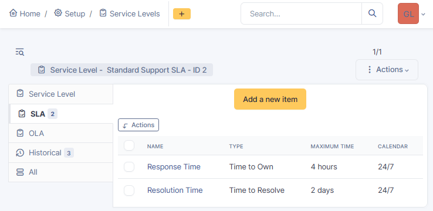
  - Escalation level settings. 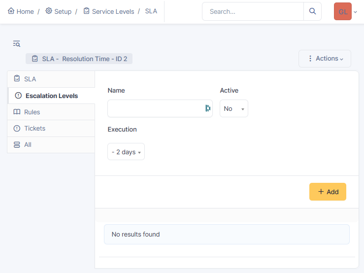
  - Escalation criterion. 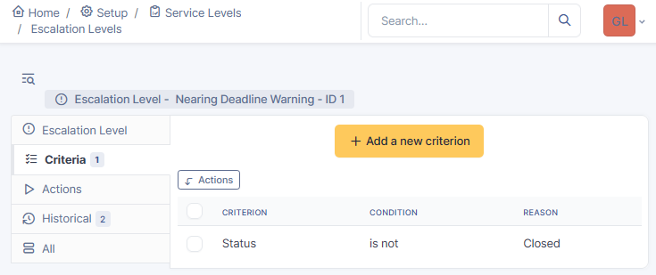
  - Escalation action. 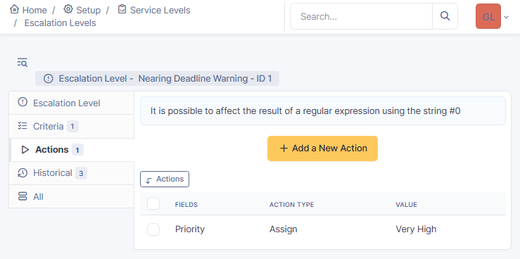
- **Status.** done

## IT asset and inventory management
- **What.** Added a handful of assets (computers, monitors, a software entry).
- **How.** _TODO (Phase 3)_
- **Why it matters.** Tying assets to tickets gives context for support and a basis for inventory tracking.
- **Screenshot.** _TODO_
- **Status.** _pending_

## Knowledge base documentation
- **What.** A knowledge base article (for example, a password reset how-to).
- **How.** _TODO (Phase 3)_
- **Why it matters.** Documented, reusable answers reduce repeat tickets and speed resolution.
- **Screenshot.** _TODO_
- **Status.** _pending_

## Ticket routing and queue management
- **What.** Two support groups (`Service Desk`, `Network Team`) with a technician assigned to a group, plus a business rule that auto-routes tickets in the `Network` category to the `Network Team`.
- **How.**
  - Created the groups under **Administration → Groups** (+ Add), then added the `tech` user to **Network Team** via the group's **Users** tab.
  - Under **Administration → Rules → Business rules for tickets**, created a rule *"Route Network category to Network Team"* (Logical operator AND, Active, applied on ticket **Add**).
    - **Criterion.** Category `is` Network
    - **Action.** Technician Group `Assign` Network Team
- **Why it matters.** Rule-based routing puts tickets in front of the right team automatically instead of by manual triage. That's the core of queue management.
- **Screenshots.**
  - Groups. 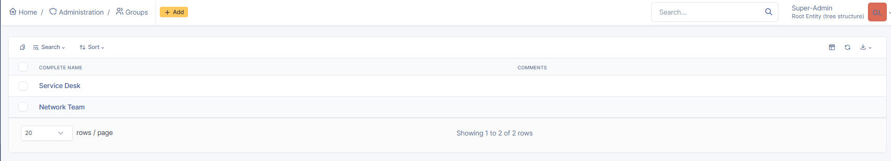
  - Technician in the Network Team. 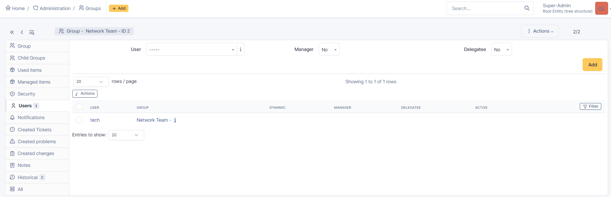
  - Rule criterion (Category is Network). 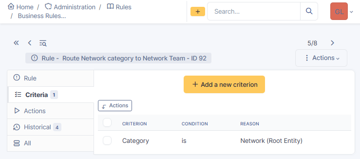
  - Rule action (assign to Network Team). 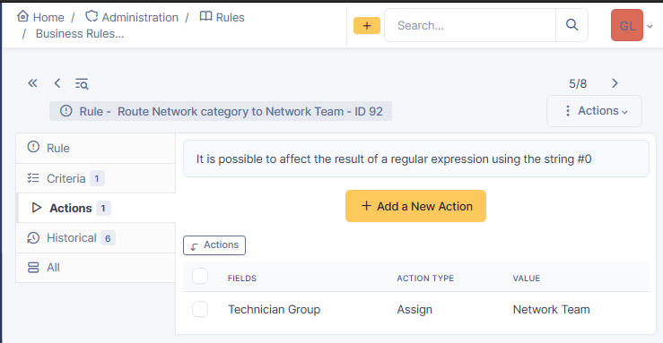
- **Status.** done

## Automated notifications (optional)
- **What.** Email notifications on ticket update.
- **How.** _only document if actually configured and working_
- **Why it matters.** Keeps requesters and technicians informed without manual follow-up.
- **Screenshot.** _TODO_
- **Status.** _not yet attempted. Will be marked skipped if not completed._
